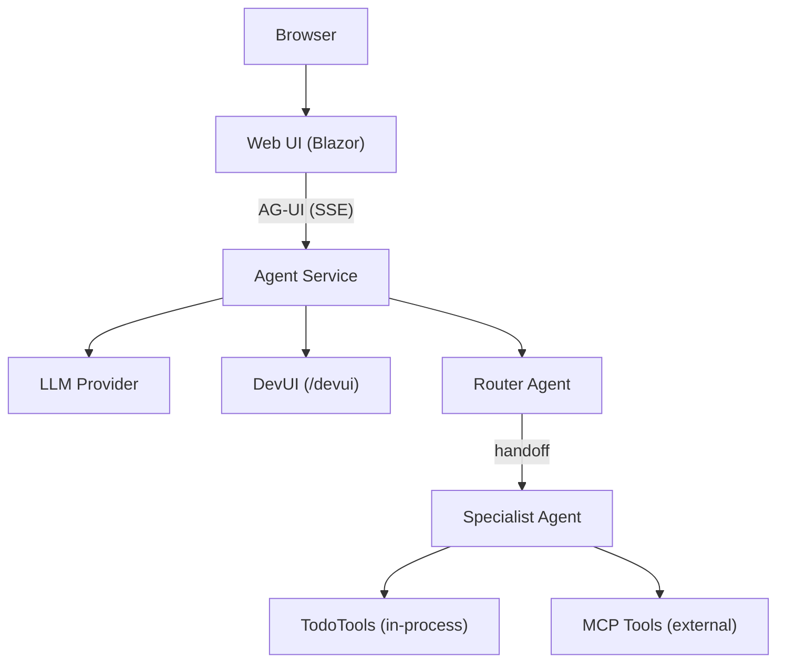

# Aspire AI Agent Starter App

A full-featured AI agent application built with [Aspire](https://aspire.dev) and the [Microsoft Agent Framework](https://learn.microsoft.com/dotnet/ai/agents). Includes a Blazor chat UI with AG-UI streaming, sample domain tools, and optional MCP server and multi-agent handoff — everything you need to start building a real agent app.

## Architecture



> Diagram shows the full-featured variant (`--IncludeHandoff --IncludeMcp`). Without those flags, the Router/Specialist become a single AI Agent, and MCP Tools are omitted.

**Key protocols:**
- **AG-UI** — Standardized streaming protocol between Web UI and Agent (Server-Sent Events)
- **Aspire service discovery** — Agent discovers the LLM via connection string injection
- **DevUI** — Built-in dev-time debugging UI at `/devui`

## Projects

| Project | Purpose |
|---------|---------|
| **XmlEncodedProjectName.AppHost** | Aspire orchestrator -- run this to start everything |
| **XmlEncodedProjectName.Agent** | AI agent service with AG-UI endpoint, DevUI, tools |
| **XmlEncodedProjectName.Web** | Blazor Server chat UI with streaming responses |
| **XmlEncodedProjectName.ServiceDefaults** | Shared OpenTelemetry, health checks, resilience |
<!--#if (IncludeMcp) -->
| **XmlEncodedProjectName.Mcp** | MCP server hosting external tools (Model Context Protocol) |
<!--#endif -->

## Getting Started

### 1. Configure Your AI Provider

<!--#if (UseFoundry) -->
**Microsoft Foundry** — The model deployment is declared in the AppHost's `AppHost.cs` — Aspire auto-provisions the Microsoft Foundry resource on first run.

Make sure you're logged in:

```bash
az login
```

On **first run**, Aspire will prompt for your Azure subscription, location, and resource group, then provision the Foundry resource and model deployment. This takes 3-10 minutes. Subsequent runs start instantly (provisioning state is cached).

To change the model, edit the `AddModelDeployment` call in the AppHost's `AppHost.cs`:

```csharp
var chat = foundry.AddModelDeployment("chat", FoundryModel.OpenAI.Gpt4oMini);  // ← change this
```

Aspire detects the change automatically and re-provisions on next run (~30-60s).
<!--#elif (UseFoundryLocal) -->
**Foundry Local** — Install Foundry Local for zero-config local LLM:
https://learn.microsoft.com/azure/ai-foundry/foundry-local/get-started

No Azure account or API keys needed. The model runs entirely on your machine.

<!--#elif (UseAzureOpenAI) -->
**Azure OpenAI** — Set the connection string. Aspire prompts in the dashboard if not configured, or set in user-secrets:

```bash
cd XmlEncodedProjectName.AppHost
dotnet user-secrets set "ConnectionStrings:openai" "https://your-resource.openai.azure.com/"
```

You need an Azure OpenAI resource with a deployed model. The app uses `DefaultAzureCredential` -- make sure you are logged in:

```bash
az login
```

Optionally set the model deployment name (defaults to `gpt-4o-mini`):

```bash
cd XmlEncodedProjectName.Agent
dotnet user-secrets set "OpenAI:Deployment" "gpt-4o-mini"
```
<!--#else -->
**OpenAI** — Set the connection string. Aspire prompts in the dashboard if not configured, or set in user-secrets:

```bash
cd XmlEncodedProjectName.AppHost
dotnet user-secrets set "ConnectionStrings:openai" "Endpoint=https://api.openai.com/v1;Key=sk-your-api-key"
```

For **GitHub Models**, use:

```bash
dotnet user-secrets set "ConnectionStrings:openai" "Endpoint=https://models.inference.ai.azure.com;Key=ghp_your-token"
```

Optionally set the model name (defaults to `gpt-4o-mini`):

```bash
cd XmlEncodedProjectName.Agent
dotnet user-secrets set "OpenAI:Deployment" "gpt-4o-mini"
```
<!--#endif -->

### 2. Run the App

```bash
aspire start
```

This starts the Aspire dashboard, the Agent service, and the Web UI. Open the dashboard URL shown in the console to see all services.

### 3. Chat with the Agent

Open the Web UI link from the Aspire dashboard. Responses stream in real-time via AG-UI. Try:
- "Add a todo to buy groceries"
- "What's on my list?"
- "Mark item 1 as complete"
- "Delete item 2"

### 4. Use DevUI (Development)

When running locally, the Agent service includes **DevUI** -- a built-in web interface from the Microsoft Agent Framework for debugging and testing agents.

DevUI lets you:
- **Chat directly with the agent** without the Blazor UI
- **Inspect registered tools** and their parameters
- **Trace tool calls** and agent reasoning

Access DevUI from the **Agent service URL** in the Aspire dashboard (it links directly to `/devui`).

> **Note:** DevUI is only available in the `Development` environment. It is not mapped in production.

<!--#if (IncludeMcp) -->
### 5. MCP Server (Model Context Protocol)

This project includes an **MCP server** (`XmlEncodedProjectName.Mcp`) that hosts domain tools accessible via the Model Context Protocol. The agent discovers and invokes these tools automatically at startup via Aspire service discovery.

**How it works:**
1. The MCP server starts as a separate Aspire project
2. At agent startup, `McpToolProvider` connects to the MCP server URL (injected by Aspire)
3. Available tools are discovered via `ListToolsAsync()` and merged with in-process tools
4. The agent can invoke both in-process tools (e.g. `TodoTools`) and MCP tools in conversations

**Add a new MCP tool:**

1. Add a method to `SampleTools.cs` (or create a new tools class):
   ```csharp
   [McpServerTool, Description("Looks up weather for a city")]
   public static string GetWeather([Description("City name")] string city)
   {
       return $"Weather in {city}: 72°F, sunny";
   }
   ```
2. The tool is automatically discovered -- no additional registration needed.

**Learn more:** [MCP in .NET](https://learn.microsoft.com/dotnet/ai/quickstarts/build-mcp-server)

<!--#endif -->
<!--#if (IncludeHandoff) -->
### Multi-Agent Handoff

This project uses a **multi-agent handoff workflow** where a Router agent classifies user intent and routes to specialist agents:

| Agent | Role |
|-------|------|
| **Router** | Entry point — understands user intent and hands off to the right specialist |
| **Specialist** | Handles todo list management using domain tools |

The handoff workflow is powered by `AgentWorkflowBuilder` from `Microsoft.Agents.AI.Workflows`. The Router and Specialist can hand off to each other seamlessly.

**Add a new specialist agent:**

1. Register a new agent in `Program.cs`:
   ```csharp
   builder.AddAIAgent("Analytics", (sp, name) =>
   {
       var openaiClient = sp.GetRequiredService<OpenAI.OpenAIClient>();
       var chatClient = openaiClient.GetChatClient(deployment).AsIChatClient();
       return chatClient.AsAIAgent(
           name: name,
           instructions: "You analyze todo completion trends and productivity...",
           tools: analyticsTools);
   });
   ```

2. Add it to the workflow handoff rules:
   ```csharp
   return AgentWorkflowBuilder.CreateHandoffBuilderWith(router)
       .WithHandoffs(router, [specialist, analytics])  // Router can route to both
       .WithHandoffs(specialist, router)
       .WithHandoffs(analytics, router)
       .Build();
   ```

3. Update the Router's instructions to describe the new specialist.

**Learn more:** [Agent Handoff Workflows](https://learn.microsoft.com/agent-framework/workflows/orchestrations/handoff)

<!--#endif -->
## How to Extend

### Add a new tool

1. Add a method to `TodoTools.cs` (or create a new tools class):
   ```csharp
   [Description("Search todos by keyword")]
   public string SearchTodos([Description("Keyword to search for")] string keyword)
   {
       var matches = todoService.List().Where(t => t.Title.Contains(keyword, StringComparison.OrdinalIgnoreCase));
       return matches.Any() ? string.Join("\n", matches) : "No matches found.";
   }
   ```

2. Register it in the `AsAIFunctions()` method:
   ```csharp
   AIFunctionFactory.Create(SearchTodos, nameof(SearchTodos))
   ```

### Swap the AI provider

The LLM is configured in the AppHost's `AppHost.cs`. The Agent resolves `OpenAI.OpenAIClient` from DI — no direct Azure SDK imports needed.

**Change the model** (Foundry provider):

```csharp
var chat = foundry.AddModelDeployment("chat", FoundryModel.OpenAI.Gpt4oMini);  // ← change this
```

Aspire detects the change and re-provisions automatically (~30-60s on next run).

**Switch to a different provider** — change the AppHost configuration:

```csharp
// Azure OpenAI — via connection string
var openai = builder.AddConnectionString("openai");

// Azure OpenAI with provisioning (Aspire auto-provisions)
var openai = builder.AddAzureOpenAI("openai")
    .AddModelDeployment("chat", "gpt-4o", "2024-05-13");
```

**Use a pre-existing Azure resource** — skip auto-provisioning:

```csharp
var foundry = builder.AddFoundry("foundry")
    .RunAsExisting("my-foundry-resource-name", "my-resource-group");
var chat = foundry.AddModelDeployment("chat", FoundryModel.OpenAI.Gpt4oMini);
```

### Add a real domain service

Replace `TodoService` with your own domain (e.g., database-backed Orders, Customers):

1. Create your service class and register in DI
2. Create a tools class that wraps your service methods
3. Update the `AIAgent` registration to use your tools

## Learn More

- [Aspire documentation](https://aspire.dev)
- [Microsoft Agent Framework](https://learn.microsoft.com/dotnet/ai/agents)
- [AG-UI Protocol](https://learn.microsoft.com/agent-framework/ag-ui/)
- [DevUI](https://learn.microsoft.com/agent-framework/devui/)
- [Microsoft.Extensions.AI](https://learn.microsoft.com/dotnet/ai/ai-extensions)
