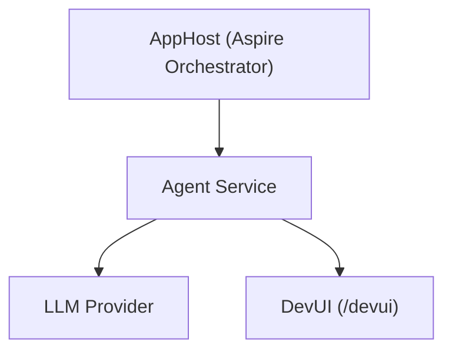

# Aspire AI Agent

A minimal AI agent service built with [Aspire](https://learn.microsoft.com/dotnet/aspire/) and the [Microsoft Agent Framework](https://learn.microsoft.com/dotnet/ai/agents). This template provides the foundation — an Aspire-orchestrated agent with DevUI for testing — so you can focus on adding your own tools and domain logic.

## Architecture



## Projects

| Project | Purpose |
|---------|---------|
| **XmlEncodedProjectName.AppHost** | Aspire orchestrator — run this to start everything |
| **XmlEncodedProjectName.Agent** | AI agent service with DevUI for testing |
| **XmlEncodedProjectName.ServiceDefaults** | Shared OpenTelemetry, health checks, resilience |

## Getting Started

### 1. Configure Your AI Provider

<!--#if (UseFoundry) -->
**Microsoft Foundry** — The model deployment is declared in the AppHost — Aspire provisions it automatically on first run.

Make sure you're logged in:

```bash
az login
```

<!--#elif (UseFoundryLocal) -->
**Foundry Local** — Install Foundry Local for zero-config local LLM:
https://learn.microsoft.com/azure/ai-foundry/foundry-local/get-started

No Azure account or API keys needed.

<!--#elif (UseAzureOpenAI) -->
**Azure OpenAI** — Set the connection string in the **AppHost** project:

```bash
cd XmlEncodedProjectName.AppHost
dotnet user-secrets set "ConnectionStrings:openai" "Endpoint=https://your-resource.openai.azure.com/"
```

Make sure you're logged in: `az login`

<!--#else -->
**OpenAI** — Set the connection string in the **AppHost** project:

```bash
cd XmlEncodedProjectName.AppHost
dotnet user-secrets set "ConnectionStrings:openai" "Endpoint=https://api.openai.com/v1;Key=sk-your-key"
```

For **GitHub Models**: `"Endpoint=https://models.inference.ai.azure.com;Key=ghp_your-token"`

<!--#endif -->

### 2. Run

```bash
aspire start
```

Open the Aspire dashboard URL shown in the console. Click the agent's endpoint to open DevUI.

### 3. Chat

DevUI provides a chat interface for testing your agent. Try asking anything — the agent is a general-purpose assistant by default.

## Next Steps

This is a starting point. To build a real application:

- **Add tools** — Create a tools class with `[Description]` attributes, register with `AsAIFunctions()`
- **Add a web UI** — Use `dotnet new aspire-agent-starter --IncludeWeb` for a Blazor chat frontend
- **Add MCP tools** — Use `dotnet new aspire-agent-starter --IncludeMcp` for external tool hosting
- **Add multi-agent handoff** — Use `dotnet new aspire-agent-starter --IncludeHandoff` for Router/Specialist patterns

Or see the full template: `dotnet new aspire-agent-starter`

## Learn More

- [Aspire documentation](https://learn.microsoft.com/dotnet/aspire/)
- [Microsoft Agent Framework](https://learn.microsoft.com/dotnet/ai/agents)
- [DevUI](https://learn.microsoft.com/agent-framework/devui/)
- [Microsoft.Extensions.AI](https://learn.microsoft.com/dotnet/ai/ai-extensions)
